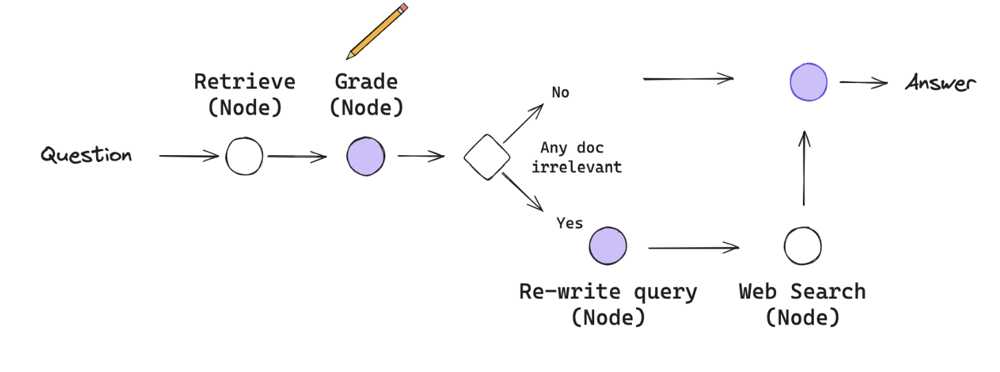
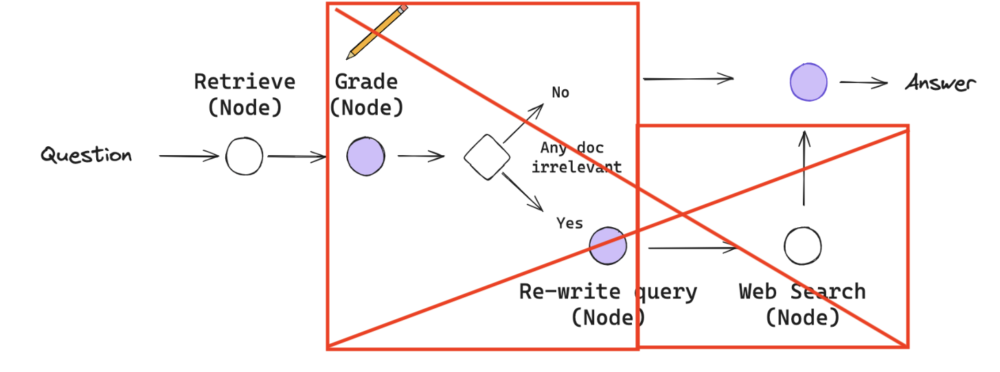

       

# RAG-vs-CRAG

## Table of Contents

- [Project Title](#project-title)
- [Project Description](#project-description)
- [Installation and User Guide](#installation-and-user-guide)
- [Comparison Between RAG and CRAG](#comparison-between-rag-and-crag-architecture)

# Project Title

In this project, we delve into the comparison between two advanced approaches in the field of Generative AI : Retrieval-Augmented Generation (RAG) and Corrective Retrieval-Augmented Generation (CRAG). Both methodologies leverage external knowledge sources to enhance the generation of more accurate and contextually relevant responses. However, they differ in their mechanisms and effectiveness in various applications.

# Project Description

This project aims to provide a detailed analysis of RAG and CRAG, highlighting their key differences, advantages, and potential use cases. We will explore:

- Implementation user guide for both RAG and CRAG agents
- Comparative performance
- Implementation difference between both RAG and CRAG

By the end of this project, we hope to offer insights into which method may be more suitable for specific scenarios and how these technologies can be further developed to improve agentic framework development systems.

# Installation and User Guide

How you can run this system in your local machine as described below:

- Clone this repo 
  - Download and open [VS Code](https://code.visualstudio.com/Download) in your laptop
  - Click on `Terminal` and open a `New Terminal`
  - Go to `File` and select `Open Folder` and selecr the folder you want to save this repo in
  - Download `Git` so that you can run `git` commands
  - In the terminal, type `git clone https://github.com/anishg93/RAG-vs-CRAG.git` (To run `git commands`)
- Create a virtual environment with `Python >= 3.10.0`
  - In the terminal type `conda create -n rag_vs_crag python==3.10.0`
  - Once this is done, activate the virtual environment using `conda activate rag_vs_crag`
- In the terminal, install all the necessary libraries using 
    ```python
    pip install -r requirements.txt
    ```
- Download `ollama` for desktop from [Ollama Official Site](https://ollama.com/)
- Choose some LLM models for your task. I chose `Llama3 8B` (you can choose some other models as well)
- You can change the model name in `/rag_vs_crag/app/streamlit_main.py` in the variable `local_llm` as shown below,
  ```python
  local_llm = "<your_LLM_model_name>"  ##line 65
  ```
- Go to [Tavily](https://tavily.com/) and create an API key which would be required for web-search
  - Once you get your API key, in VS code, create a `.env` file under root directory and paste the following:
  ```python
  TAVILY_API_KEY="<YOUR_TAVILY_API_KEY>"
  ```
  - Remember to add `.env` to `.gitignore` so that your `TAVILY_API_KEY` does not get leaked
- You can also change the embedding model name in `../streamlist_main.py` in `embedding_model_name` as shown below,
  ```python
  embedding_model_name = "<your_embedding_model_name>"  ##line 66
  ```
  - You can choose any [Hugging Face Sentence Transformers Models](https://www.sbert.net/docs/sentence_transformer/pretrained_models.html) for document embedding for the retriever
- Select any website link that you want to get some information on and paste it like below,
```python
url = "<your_url>"
```
  - You can also give a list of urls on the same topic like `url = [url1, url2, ...]`
- Open a new terminal with virtual env activated and then type the following,
```bash
cd rag_vs_crag/app
streamlit run streamlit_main.py
```
  - It will open the chat interface where you can chat with the RAG/CRAG agent (there is a dropdown to select from rag/crag) about the website link you prvided
  - The field to provide website url is editable so any point in time you can change the link in the interface itself.
  - If you do not want to provide any website url, you also have a chance to upload one or multiple pdf files on the same topic in the interface (there is an option to upload)
  - The chat history will also be displayed and saved
  - **Happy chatting!**

## Comparison Between RAG and CRAG Architecture

The CRAG architecture can be described as following:



So, for example, let's say you have provided a website link where some information is incomplete or wrong. If you select `CRAG` it will work like below:
- Retrive the document from the provided context (website url)
- Grade the document in terms of information relevance 
  - If any one of the retrieved document is `irrelavant` then the agent will
    - Rewrite the user query
    - Will do an external web search with the modified query for knowledge base refinement
- Finally it will generate the desired response
<br>

The RAG architecture can be described as following:



If you select `RAG` it will work like below:
- Retrive the document from the provided context (website url)
- Augment a prompt template with the user query and retrieved document
- Finally it will generate the desired response

The disadvantage of `RAG` is it won't be able to refine the knowledge base if the information provided in the context is wrong or missing. This is a really nice advantage of using `CRAG` over `RAG`.
